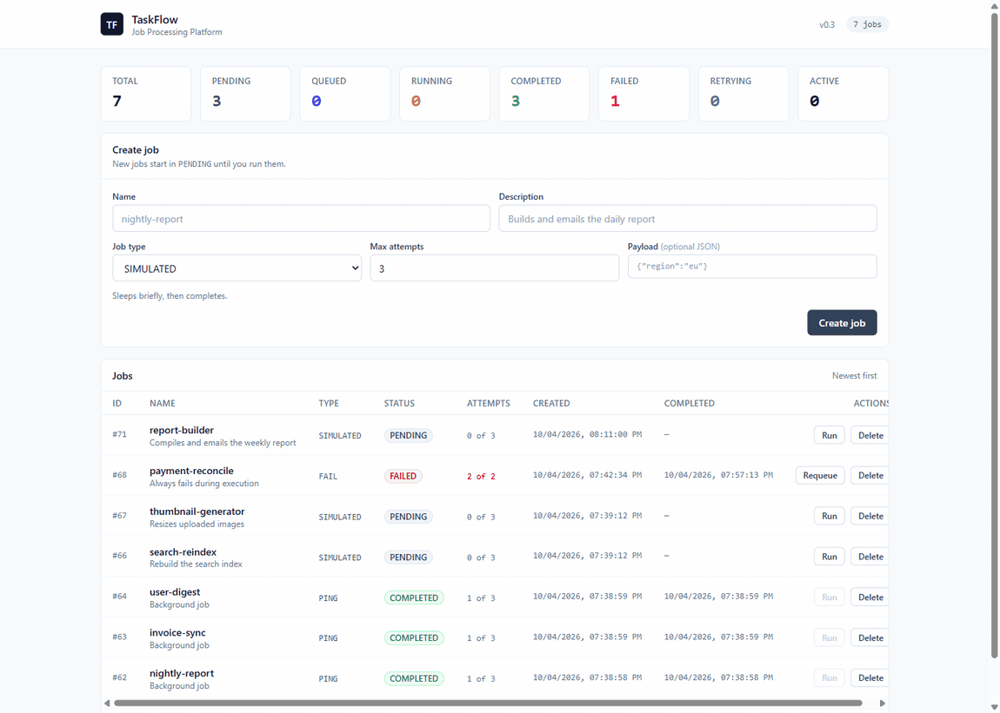
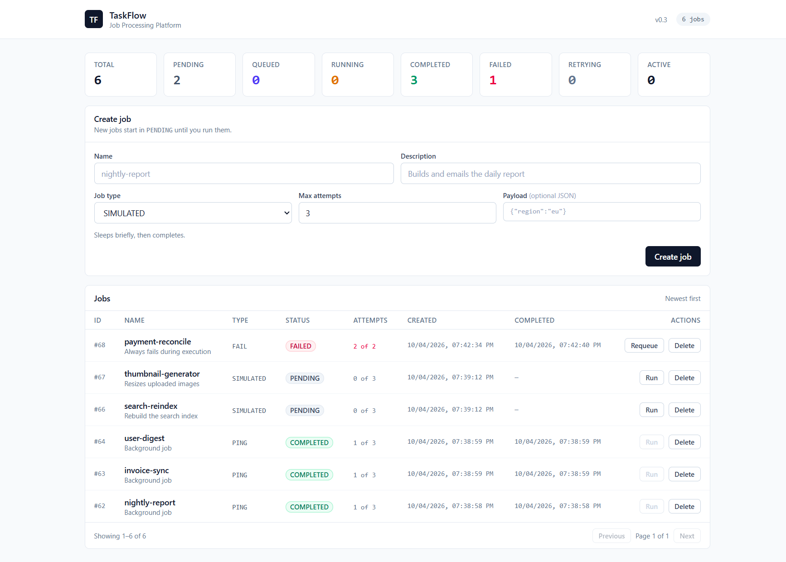
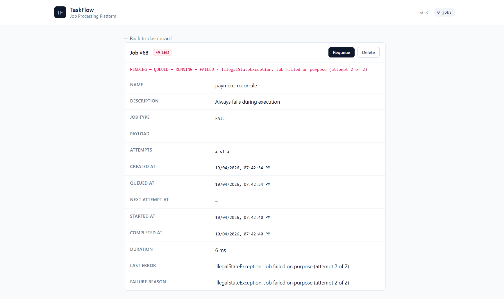

<div align="center">

# TaskFlow

**A background job processing platform.**
Submit work through a REST API, run it asynchronously via a Redis queue and a separate worker, with retries and a dead-letter queue built in.

[](https://openjdk.org/)
[](https://spring.io/projects/spring-boot)
[](https://react.dev/)
[](https://www.postgresql.org/)
[](https://redis.io/)
[](https://docs.docker.com/compose/)

</div>

<div align="center">



*Pressing **Run** — the job queues, a worker claims it, and it completes. The page updates itself.*

</div>

<div align="center">



*Live counts per status, a create form with job types and payloads, and a paginated table with
per-job attempts and actions.*

</div>

---

## The problem

Slow work doesn't belong in a web request.

```
User clicks "Generate report"
  → the request hangs for 40 seconds
  → server restarts mid-way, the work is lost forever
  → it fails halfway through and nothing knows
  → 100 users at once = 100 overloaded threads
```

TaskFlow turns that into a queue:

```
User clicks "Generate report"
  → API saves the job, pushes the id, returns in 5ms
  → a background worker picks it up
  → UI shows live progress
  → failures retry automatically, then get quarantined
```

The request never blocks. Work survives restarts. Failures are handled.

## The lifecycle

```
PENDING ──Run──▶ QUEUED ──worker claims──▶ RUNNING ──┬─▶ COMPLETED
                  ▲                                   │
                  └───── attempts remain ───────┐    └─▶ FAILED
                                                └────── attempts used up ──▶ FAILED + dead letter
```

| Status     | Meaning                                                        |
| ---------- | -------------------------------------------------------------- |
| `PENDING`  | Created, waiting for you to run it                              |
| `QUEUED`   | Its id is in Redis, waiting for a worker                         |
| `RUNNING`  | A worker has claimed it and is executing                        |
| `COMPLETED`| Finished successfully                                           |
| `FAILED`   | Gave up. Requeue it to try again                                |

---

## Contents

- [Features](#features)
- [Quick start](#quick-start)
- [Try it](#try-it)
- [Architecture](#architecture)
- [How it works](#how-it-works)
- [API](#api)
- [Configuration](#configuration)
- [Project structure](#project-structure)
- [Testing](#testing)
- [Design decisions](#design-decisions)
- [Limitations](#limitations)
- [Roadmap](#roadmap)
- [Contributing](#contributing)

---

## Features

| | |
|---|---|
| **Async execution** | REST API enqueues, a separate worker service executes |
| **Automatic retries** | Exponential backoff — 5s, 10s, 20s… capped at 5m |
| **Dead-letter queue** | Exhausted jobs are quarantined, never silently dropped |
| **Exactly-once claiming** | One conditional `UPDATE` decides ownership — duplicate deliveries and extra workers can't run the same attempt twice |
| **Live UI** | Status updates every second, no refresh needed |
| **Pluggable job types** | Write one handler, inherit the queue, retries and UI |
| **Graceful degradation** | Redis or worker down? Jobs wait safely in `QUEUED` and resume automatically |
| **Horizontal scaling** | `docker compose up -d --scale worker=3` |
| **Cursor pagination** | Constant-time paging, stable while new jobs arrive |
| **Flyway migrations** | Schema owned by versioned SQL, verified by Hibernate on boot |

## Quick start

Requires Docker and Docker Compose. Nothing else.

```bash
git clone https://github.com/prakashseervi61/TaskFlow.git
cd TaskFlow
docker compose up --build
```

Open **<http://localhost:5173>**.

That starts five services: PostgreSQL, Redis, the API, the worker, and the frontend. No database setup, no seeding — Flyway creates the schema on first boot.

<details>
<summary>Running without Docker</summary>

Needs JDK 21+, Maven, PostgreSQL and Redis.

```bash
psql -U postgres -c "CREATE ROLE taskflow LOGIN PASSWORD 'taskflow';"
psql -U postgres -c "CREATE DATABASE taskflow OWNER taskflow;"

mvn clean package

export DB_HOST=localhost DB_NAME=taskflow DB_USERNAME=taskflow DB_PASSWORD=taskflow
export REDIS_HOST=localhost
java -jar backend/target/taskflow-backend-0.3.0.jar   # terminal 1

java -jar worker/target/taskflow-worker-0.3.0.jar     # terminal 2

cd frontend && npm install && npm run dev             # terminal 3
```

</details>

## Try it

1. **Create a job** — pick `SIMULATED`, max attempts `3`. It appears as `PENDING`.
2. **Press Run.** Watch it go `QUEUED → RUNNING → COMPLETED` without refreshing.
3. **Open it** for timestamps, duration and attempt count.

   

4. **Watch a retry.** Create a job with type `FAIL` and run it. Each attempt fails, the delay grows between tries, and after the last attempt it lands as `FAILED` with a **Requeue** button.
5. **Break it on purpose.** Stop the worker, press Run — the job waits in `QUEUED`. Start the worker and it picks up where it left off.

## Architecture

```
┌────────┐     ┌──────────────┐     ┌─────────────┐     ┌───────┐     ┌────────┐
│ React  │ ──▶ │  Backend API │ ──▶ │ PostgreSQL  │     │ Redis │ ◀── │ Worker │
│        │     │              │     │             │     │       │     │        │
│  :5173 │     │    :8080     │     │  system of  │     │ queue │     │  none  │
└────────┘     └──────────────┘     │   record    │     └───────┘     └────────┘
                 saves + enqueues    └─────────────┘       ▲                │
                                                       LPUSH after         │
                                                       DB commit           │
                                                          └──── BRPOP ───────┘
                                                               writes results
```

The worker is **headless** — it runs no HTTP server and publishes no port, which is also why
`--scale worker=N` works without port collisions.

Three Redis keys, each with one job:

| Key                      | Type        | Purpose                                      |
| ------------------------ | ----------- | -------------------------------------------- |
| `taskflow:jobs`          | list        | Job ids waiting for a worker                 |
| `taskflow:jobs:scheduled`| sorted set  | Retries waiting out their backoff, scored by time |
| `taskflow:jobs:dlq`      | list        | Ids whose retries were exhausted             |

Inspect them live:

```bash
docker compose exec -T redis redis-cli LLEN  taskflow:jobs
docker compose exec -T redis redis-cli ZRANGE taskflow:jobs:scheduled 0 -1 WITHSCORES
docker compose exec -T redis redis-cli LRANGE taskflow:jobs:dlq 0 -1
```

## How it works

### Nobody runs a job twice

Redis removes an id from the queue *before* the work is done, and it may deliver the same id
more than once. With several workers, "exactly once" can't come from the queue — so it comes
from the database. Every transition is one conditional UPDATE:

```sql
-- the worker's ownership handshake
UPDATE jobs SET status = 'RUNNING', attempt_count = attempt_count + 1
WHERE id = ? AND status = 'QUEUED';
```

Racing workers hit the same row. Exactly one gets `1 row updated`; the others get `0` and skip.
The same trick at queue time stops a double-clicked Run button creating two jobs.

*Verified: 12 jobs across 3 worker replicas → 12 executions, 0 duplicates.*

### Publishing waits for the commit

The API publishes to Redis from an `AFTER_COMMIT` listener, not from inside the transaction.
Publishing earlier is faster and lets the API report failures as `503` — but it also lets a
worker consume an id whose row isn't committed yet, and that job would vanish. In v0.1 this bug
stranded jobs in `RUNNING` forever.

### Retries don't hold a worker

Redis has no "push at time T". So a retry is scored in a **sorted set** by the instant it becomes
eligible, and a one-second tick promotes whatever is due onto the main list. A job waiting out a
ten-minute backoff costs one Redis entry, not a thread.

### Nothing gets lost

| Something breaks | What happens |
|---|---|
| Redis unreachable (API) | Job is released back to `PENDING` with a reason; press Run again |
| Redis unreachable (worker) | Loop logs, backs off 5s, resumes automatically |
| Worker goes down | Jobs sit in `QUEUED` with ids in Redis; re-published on worker startup |
| Worker dies **before** claiming | Still `QUEUED`, so the same recovery applies |
| Worker dies **after** claiming | ⚠️ Stranded in `RUNNING` — no lease to expire it. See [Limitations](#limitations) |
| Dead-letter push fails | Row is already `FAILED`, and the API lists dead letters from PostgreSQL |

The **dies after claiming** row is a real gap rather than an oversight: recovery only looks at
`QUEUED`, so it cannot see a job that already became `RUNNING`.

## API

Base URL `http://localhost:8080`

| Method | Path | Result |
|---|---|---|
| `POST` | `/api/jobs` | `201` create a job |
| `GET` | `/api/jobs` | `200` one page — `?limit=&cursor=` |
| `GET` | `/api/jobs/{id}` | `200` job detail |
| `GET` | `/api/jobs/stats` | `200` counts per status |
| `GET` | `/api/jobs/dead-letter` | `200` exhausted jobs |
| `POST` | `/api/jobs/{id}/execute` | `200` queue a job |
| `POST` | `/api/jobs/{id}/requeue` | `200` retry a failed job |
| `DELETE` | `/api/jobs/{id}` | `204` delete |

Errors use one shape: `{ timestamp, status, error, message, path, fieldErrors }`
→ `400` validation, `404` missing, `409` wrong state, `500` unexpected.

```bash
BASE=http://localhost:8080/api/jobs

# Create
curl -X POST "$BASE" -H "Content-Type: application/json" \
  -d '{"name":"nightly-report","description":"Builds the daily report","maxAttempts":3}'

# Run, then watch
curl -X POST "$BASE/1/execute"
curl "$BASE/1"

# A job that always fails, to exercise retries and the dead letter queue
curl -X POST "$BASE" -H "Content-Type: application/json" \
  -d '{"name":"payment-reconcile","description":"Always fails","jobType":"FAIL","maxAttempts":2}'
```

## Configuration

Everything is environment-driven; nothing sensitive is hardcoded. See
[`backend/.env.example`](backend/.env.example) and [`worker/.env.example`](worker/.env.example).

| Variable | Default | Applies to |
|---|---|---|
| `DB_HOST` `DB_PORT` `DB_NAME` `DB_USERNAME` | `localhost` `5432` `taskflow` `postgres` | both |
| `DB_PASSWORD` | **required** | both |
| `REDIS_HOST` `REDIS_PORT` | `localhost` `6379` | both |
| `JOB_QUEUE_KEY` | `taskflow:jobs` | both — must match |
| `JOB_SIMULATED_DURATION_MS` | `2500` | worker |
| `JOB_DEFAULT_MAX_ATTEMPTS` | `3` | both |
| `JOB_RETRY_BASE_DELAY` | `5s` | both — doubles per attempt |
| `JOB_RETRY_MAX_DELAY` | `5m` | both |
| `WORKER_CONCURRENCY` | `2` | worker |
| `CORS_ALLOWED_ORIGINS` | `http://localhost:5173` | API |

## Project structure

```
taskflow/
├── pom.xml                  # parent — modules: core, backend, worker
├── core/                    # shared domain + Flyway migrations
│   └── src/main/{java/com/taskflow/{config,dto,entity,exception,handler,repository,retry},
│                 resources/db/migration}
├── backend/                 # REST API
│   └── src/main/{java/com/taskflow/{config,controller,exception,queue,service},resources}
├── worker/                  # queue consumer
│   └── src/main/{java/com/taskflow/worker/{config,handler,job},resources}
├── frontend/
│   └── src/{api,components,hooks,lib,pages}
├── docker/                  # Dockerfile (MODULE build arg)
├── docs/images/             # README assets
└── docker-compose.yml
```

| Module | Role |
|---|---|
| `core` | Domain model, repository queries, `JobHandler` contract and the migrations, shared by both services so they run identical DDL. |
| `backend` | REST API. Never executes work; only saves jobs and publishes their ids. |
| `worker` | Queue consumer. Claims jobs, runs handlers, settles the outcome. |
| `frontend` | React dashboard. |

## Testing

```bash
mvn test                # 76 tests
cd frontend && npm run lint && npm run build
```

| Area | Suite | Covers |
|---|---|---|
| Backoff | `BackoffPolicyTest` | doubling, cap, overflow safety |
| API | `JobServiceTest`, `JobControllerTest`, `RedisJobQueueTest`, `JobExecutionDispatcherTest`, `JobReleaseServiceTest` | creation, queueing rules, cursor paging, status codes, validation, error shape, releasing on outage |
| Worker | `JobExecutorTest`, `RetrySchedulerTest`, `QueuedJobRecoveryTest`, `RedisJobQueueReaderTest`, `JobWorkerConsumerTest` | claiming, handler dispatch, retry vs dead letter, due-retry promotion, recovery, consumer resilience |

Beyond the suite, these were verified against real PostgreSQL and Redis: the retry chain,
dead-lettering, three-replica concurrency (12 jobs → 12 executions), cursor paging (39 jobs, no
gaps or repeats) and worker restarts mid-job.

## Design decisions

**Multi-module, shared domain.** The API and the worker must agree on the table, the statuses and
the claim queries. `core` holds them once — duplicating the entity across two services is how
schema drift starts.

**Flyway owns the schema.** Hibernate runs `ddl-auto: validate`: it checks the mapping and
nothing else. An earlier version let Hibernate write the schema, which silently froze the enum
values into a `CHECK` constraint and broke the next release.

**Claiming in the database, not Redis.** A `SETNX` lock needs TTL cleanup and is still defeated
by a worker dying mid-job. A conditional `UPDATE` is atomic, needs no cleanup, and survives
duplicate delivery, extra workers and restarts.

**Counters from the server.** Once pagination landed, deriving counts from the loaded page would
report "20 jobs" when 500 existed. The same reasoning drives polling off the server's
`activeCount`, so a queued job on page 3 still keeps the view live.

## Limitations

Known and deliberate, not hidden:

- **A worker that dies after claiming a job strands it in `RUNNING` forever.** Startup recovery
  only scans `QUEUED`, and every transition out of `RUNNING` requires the original worker, which
  is gone. `POST /requeue` only accepts `FAILED`, so the job isn't in the dead-letter list either
  — it is invisible in the UI and needs manual SQL. The fix is a lease with a reclaim timeout;
  it is the top item on the roadmap. Known to be correct about *duplicate* delivery, incomplete
  about *abandoned* delivery.
- **Redis list, not Streams.** At-least-once delivery comes from the database claim plus startup
  recovery. There's no ack or pending-entries mechanism.
- **Exactly-once execution is not exactly-once effects.** The claim guarantees one worker owns an
  attempt. It cannot stop a handler that performs five side effects, dies after three, and has all
  five repeated on retry. Job bodies need to be idempotent, and that contract isn't written down
  yet.
- **Retry policy is global.** Every job shares one base delay and cap; no per-job policy.
- **No observability.** Logs only — no metrics, dashboard or structured JSON logging.
- **No integration test suite.** The 76 tests are unit and web-slice with mocks. Only the manual
  runs above touched real infrastructure.
- **Single tenant.** No authentication, no per-user ownership.
- **No migration rollback story** for Flyway.

## Roadmap

Ordered roughly by how much they'd hurt in production, not by how fun they are.

**Correctness**

- [ ] **Lease + reclaim for abandoned jobs** — a reaper that moves stale `RUNNING` rows back to
      `QUEUED` once past a timeout, so the existing retry machinery handles them for free. Cheapest
      version reuses `startedAt` rather than adding a lease column and heartbeat thread
- [ ] **Fencing token on writes** — a slow-but-alive worker whose lease expired must not settle a
      job that has since been reclaimed. Needed for safe reclaim, not just nice-to-have
- [ ] **Documented idempotency contract** for job bodies, and a note that reclaim + non-idempotent
      body is worse than a stuck job
- [ ] **Job cancellation** while queued or running

**Reliability**

- [ ] Redis Streams with consumer groups and ack
- [ ] Per-job retry policies
- [ ] Testcontainers integration tests against real PostgreSQL and Redis

**Observability**

- [ ] Prometheus metrics and a dashboard for queue depth, latency and failure rate
- [ ] Structured JSON logging with `jobId` context

**Platform**

- [ ] Authentication and per-user ownership
- [ ] Cloud deployment

---

## Contributing

Contributions are genuinely welcome, including your first open-source PR. The codebase is small
enough to read in an evening, and the architecture decisions are written down above so you don't
have to reverse-engineer intent.

**Good first issues**

| Contribution | Why it's a good first one |
|---|---|
| **Add a job type** | Four small edits, no new concepts — see below |
| Add a status colour or empty state in the dashboard | Frontend-only, instantly visible |
| Add a config option to `docker-compose.yml` | Isolated, low risk |
| Write a missing test for an edge case you found | Self-contained |
| Improve an error message | Small and welcome |

**Adding a job type** is the best way to learn the codebase. It touches exactly four files:

1. `core/src/main/java/com/taskflow/entity/JobType.java` — add the enum constant
2. `worker/src/main/java/com/taskflow/worker/handler/YourJobHandler.java` — implement `JobHandler`
3. `worker/src/main/java/com/taskflow/worker/config/JobHandlerConfig.java` — register a `@Bean`
4. `frontend/src/lib/status.js` — add it to `JOB_TYPES`

Copy `SimulatedJobHandler`. Throwing from `execute()` is how you signal failure; the worker decides
whether that attempt retries or dead-letters.

**Before you open a PR**

```bash
mvn test                          # 76 tests must pass
cd frontend && npm run lint && npm run build
```

Keep the change focused — one concern per PR, and leave unrelated code alone. Match the existing
style; the code is plain and heavily commented, and comments here explain *why*, not *what*.

**Found something wrong?** Open an issue with what you expected, what happened, and how to
reproduce it. Bug reports with a failing test or a `curl` that shows the problem are the fastest
kind to act on.

Full details, including the local dev loop and review expectations, are in
**[CONTRIBUTING.md](CONTRIBUTING.md)**.

---

<div align="center">
<sub>Built with Java 21, Spring Boot, React and Redis. <a href="CONTRIBUTING.md">Contribute</a> · <a href="https://github.com/prakashseervi61/TaskFlow/issues">Found a bug?</a> · <a href="https://github.com/prakashseervi61/TaskFlow/issues/new?labels=good%20first%20issue">Good first issues</a></sub>
</div>
